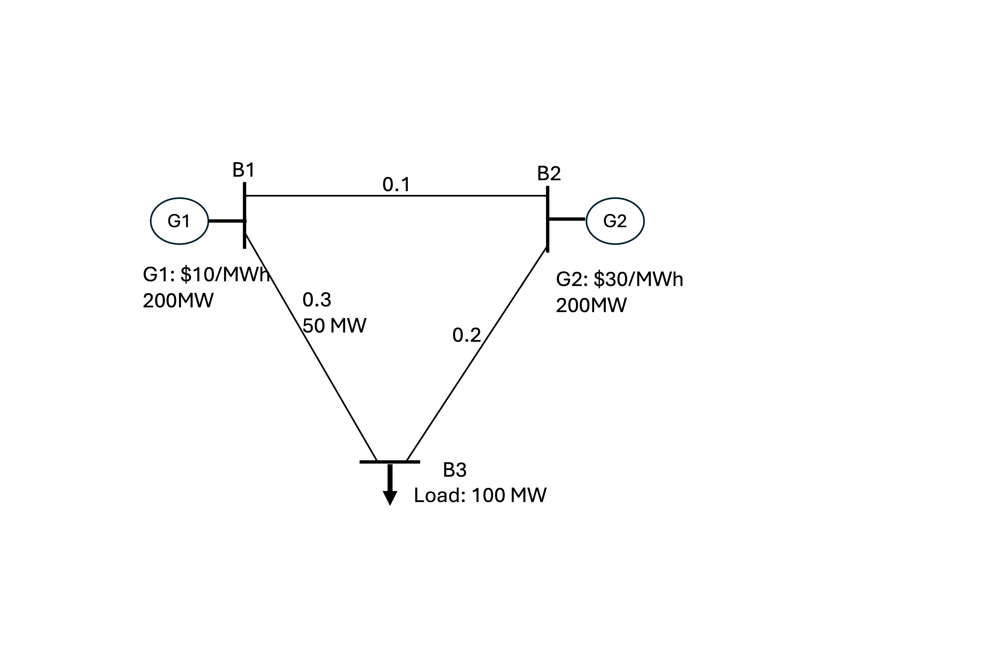

# 🔥 Why Can LMP at Some Locations Exceed the Most Expensive Unit's Price?

## 💡 Ever wondered why electricity prices at some locations spike beyond the cost of the most expensive generator?  
Let's break it down with an intuitive example!

## ⚡ Understanding Locational Marginal Pricing (LMP)
In the U.S. electricity wholesale market, prices at each bus are determined by **Locational Marginal Pricing (LMP)**—the cost of supplying an additional unit of electricity at a specific location.

- **Consumers** pay the LMP at their locations.
- **Generators** get paid based on the LMP at their connection points.

Under normal conditions, LMP is set by the most expensive unit needed to meet demand. However, **when transmission congestion occurs, LMP at some locations can exceed even the priciest generator’s cost!**

## 🔎 A Simple 3-Bus Example: Why Does LMP Spike?

### System Setup:

<figure class="blog-figure blog-figure--lmp" style="max-width: 620px; margin: 1em 0 1.5em; text-align: left;">
  
  <figcaption style="margin-top: 0.5rem; color: #555; font-size: 0.9rem; line-height: 1.35; text-align: left;">Three-bus example used to illustrate congestion-driven LMP separation.</figcaption>
</figure>

```python
transmission_lines = {
    "B1-B3": {"impedance": 0.3, "limit": 50},
    "B1-B2": {"impedance": 0.1},
    "B2-B3": {"impedance": 0.2}
}

generators = {
    "G1": {"bus": "B1", "cost": 10, "Pmax": 200},
    "G2": {"bus": "B2", "cost": 30, "Pmax": 200}
}

load = {"B3": 100}  # MW
```
G1 will have power output of 100 MW, 50 MW on Line B1-B3, 50 MW on Lines B1-B2-B3. Line B1-B3 will be on its limit.

### 🚀 What Happens When We Add 1 MW Load at B3?

```python
added_load = 1  # MW
G2_increase = 3  # MW
G1_decrease = 2  # MW

# Compute LMP at B3
lmp_b3 = (G2_increase * generators["G2"]["cost"]) - (G1_decrease * generators["G1"]["cost"])
print(f"LMP at B3: ${lmp_b3}/MWh")
```

**Output:**

```
LMP at B3: $70/MWh
```

⚠️ Due to **congestion**, the system is forced to dispatch more than the load increment from the most expensive unit and reduce the output of a cheap unit, driving LMP far beyond the highest generator’s cost!

## 🔄 How Can We Reduce LMP Spikes?
If we could **reroute power flows** by opening the B1-B3 line, all power would flow through B1-B2-B3 **without congestion**, bringing LMP at B3 down to just **$10/MWh**!

## 🔑 Key Takeaways
✅ **Congestion forces costly redispatch**, pushing LMP beyond the priciest generator.  
✅ **Transmission constraints dictate power flows**, sometimes leading to inefficient pricing.  
✅ **Investing in grid capacity can help reduce congestion** and stabilize market prices.  

🚀 Understanding these pricing dynamics is essential for **grid operators, market participants, and policymakers** aiming for an efficient and resilient electricity market.
